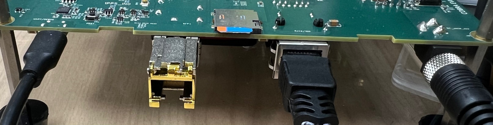
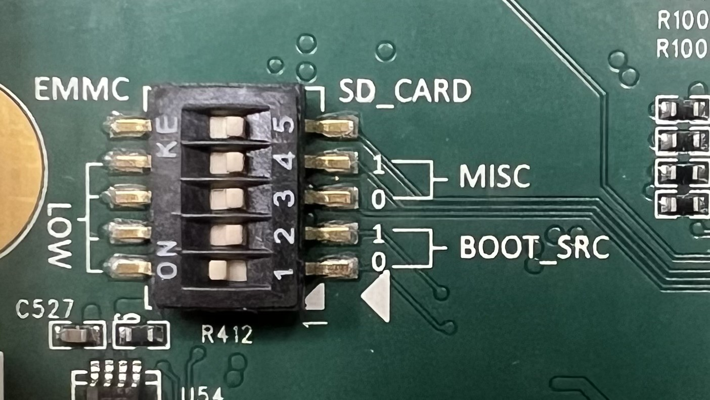

<details>
<summary><strong>Table of Contents</strong></summary>

- [MOSART Cobra SoC Quick Sanity Validation Guide](#mosart-cobra-soc-quick-sanity-validation-guide)
  - [Standalone RU Validation](#standalone-ru-validation)
  - [Expected Duration](#expected-duration)
  - [Environment Assumptions](#environment-assumptions)
  - [What This Verifies](#what-this-verifies)
    - [Linux Platform Health](#linux-platform-health)
    - [M-Plane Startup](#m-plane-startup)
    - [Verify O-RU Readiness](#verify-o-ru-readiness)
    - [DSP / Baseband Readiness](#dsp--baseband-readiness)
  - [Detailed Quick Instructions](#detailed-quick-instructions)
    - [Test Actions](#test-actions)
    - [Board Setup](#board-setup)
    - [Power-On Flow and Linux Console Login](#power-on-flow-and-linux-console-login)
    - [Update RU Manager Configuration for Quick Sanity Test](#update-ru-manager-configuration-for-quick-sanity-test)
    - [Check MRAS Running Time Status](#check-mras-running-time-status)
  - [Common Issues](#common-issues)
  - [Next Steps / Further Validation](#next-steps--further-validation)

</details>

# MOSART Cobra SoC Quick Sanity Validation Guide

## Standalone RU Validation

This document describes a basic standalone Radio Unit (RU) validation
procedure intended to verify that the software image, hardware
platform, and DSP processing pipeline are operating correctly.

This procedure validates basic software, DSP, and platform readiness
only and is not intended to replace full interoperability,
performance, RF OTA, or carrier certification testing.

The scope focuses on quick sanity testing of the MOSART software stack
and Cobra SoC evaluation platform, including successful boot,
firmware loading, DSP initialization, RF subsystem readiness, and
basic platform health checks.

This validation flow is intended for initial platform bring-up,
development verification, and software image sanity confirmation.

For comprehensive end-to-end (E2E) system testing — including CU/DU
integration, UE interoperability, O-RAN fronthaul validation, PTP
server setup, synchronization verification, and performance
evaluation — please contact:

https://metanoia-comm.com/contact/

## Expected Duration

Typical execution time for this quick sanity validation is
approximately 5–10 minutes.

## Environment Assumptions

- No DU traffic connected
- No UE attached
- No S-Plane and no PTP master

## What This Verifies

### Linux Platform Health

- Confirms successful boot flow and that the operating system is up and stable.
- Allows the use of standard Linux utilities to inspect and validate the software stack.

### M-Plane Startup

- Verifies successful M-Plane initialization and control flow.

### Verify O-RU Readiness

- Verifies that the MRAS and DSP images are successfully loaded and running.

### DSP / Baseband Readiness

- Confirms that the DSP and baseband processing are running.
- Verifies that the O-RU is in a ready state and waiting for traffic.
- Indicates readiness for live DL/UL traffic once external entities are connected.

# Detailed Quick Instructions

## Test Actions

- Connect all required cables to the Cobra EVB board and insert the SD card containing the Cobra software image.
- Configure the board jumpers correctly and set the boot mode to SD.
- Power on the board.
- Log in to the Linux console via the UART terminal.
- Start the RU Manager.
- Bring the RU to the **Active** state.
- Display DSP CU-Plane traffic status via the Linux console.

## Board Setup

Connect all required cables to the Cobra EVB, as shown below:



Ethernet network connectivity is optional for this standalone sanity
validation flow.

Locate the boot source switch on the board and configure it to boot
from the SD card.

Refer to [Cobra MTF Boot Source Pinstrap](cobra-mtf.md#cobra-soc-boot-sources-and-cobra-evb-bootstrap-pins)
for details.

- **Boot from SD:** `01`

The switch configuration should appear as follows:



## Power-On Flow and Linux Console Login

Connect to the Cobra EVB console using **minicom**, **tio**, or another terminal utility.

For example, assuming the UART is connected to `/dev/ttyUSB1` on the
host machine, run:

```bash
sudo minicom -D /dev/ttyUSB1
```

**Note**: The default serial console settings should work. You may verify them in the minicom serial port settings screen:
```
    | A -    Serial Device      : /dev/ttyUSB1                              |                                   
    | B - Lockfile Location     : /var/lock                                 |                                   
    | C -   Callin Program      :                                           |                                   
    | D -  Callout Program      :                                           |                                   
    | E -    Bps/Par/Bits       : 115200 8N1                                |                                   
    | F - Hardware Flow Control : No                                        |                                   
    | G - Software Flow Control : No                                        |                                   
    | H -     RS485 Enable      : No                                        |                                   
    | I -   RS485 Rts On Send   : No                                        |                                   
    | J -  RS485 Rts After Send : No                                        |                                   
    | K -  RS485 Rx During Tx   : No                                        |                                   
    | L -  RS485 Terminate Bus  : No                                        |                                   
    | M - RS485 Delay Rts Before: 0                                         |                                   
    | N - RS485 Delay Rts After : 0                                         |                                   
    |                                                                       |                                   
    |    Change which setting?                    
```

If the board is set up correctly, the UART console will prompt for login.
Log in using the username root and the default password 12345, as shown below.

```
U-Boot SPL 2023.01 (Jan 02 2026 - 07:13:31 +0000)
Device ID: SHUTTLE (0x28240000)
Chip ID 0000
Board ID: 10
DDRPHY: Training has run successfully (firmware complete)
DDRPHY: Training has run successfully (firmware complete)
Trying to boot from MMC1

OpenSBI v1.2
   ____                    _____ ____ _____
  / __ \                  / ____|  _ \_   _|
 | |  | |_ __   ___ _ __ | (___ | |_) || |
 | |  | | '_ \ / _ \ '_ \ \___ \|  _ < | |
 | |__| | |_) |  __/ | | |____) | |_) || |_
  \____/| .__/ \___|_| |_|_____/|____/_____|
        | |
        |_|

Platform Name             : Metanoia MT58xx Cobra EVB board
Platform Features         : medeleg
Platform HART Count       : 2
Platform IPI Device       : andes_plicsw
Platform Timer Device     : andes_plmt @ 20000000Hz
Platform Console Device   : uart8250
Platform HSM Device       : ---
Platform PMU Device       : andes_pmu
Platform Reboot Device    : mta58xx
Platform Shutdown Device  : ---
Firmware Base             : 0x80000000
Firmware Size             : 244 KB
Runtime SBI Version       : 1.0

Domain0 Name              : root
Domain0 Boot HART         : 0
Domain0 HARTs             : 0*,1*
Domain0 Region00          : 0x0000000080000000-0x000000008003ffff ()
Domain0 Region01          : 0x000000000c400000-0x000000000c7fffff (I,R)
Domain0 Region02          : 0x000000000c800000-0x000000000cbfffff (I)
Domain0 Region03          : 0x0000000000000000-0xffffffffffffffff (R,W,X)
Domain0 Next Address      : 0x0000000081200000
Domain0 Next Arg1         : 0x0000000081100000
Domain0 Next Mode         : S-mode
Domain0 SysReset          : yes

Boot HART ID              : 0
Boot HART Domain          : root
Boot HART Priv Version    : v1.11
Boot HART Base ISA        : rv64imafdcnx
Boot HART ISA Extensions  : none
Boot HART PMP Count       : 32
Boot HART PMP Granularity : 8
Boot HART PMP Address Bits: 36
Boot HART MHPM Count      : 4
Boot HART MHPM Bits       : 64
Boot HART MIDELEG         : 0x0000000000000222
Boot HART MEDELEG         : 0x000000000000b109


U-Boot 2023.01 (Jan 02 2026 - 07:13:31 +0000)

DRAM:  Overwrite PLL clock 900000000 for MT28XX(0)
2 GiB (effective 4 GiB)
Core:  40 devices, 22 uclasses, devicetree: board
WDT:   Not starting wdt@10090000
Flash: 0 Bytes
MMC:   mmc@4100000: 0
Loading Environment from MMC... OK
In:    serial@100e0000
Out:   serial@100e0000
Err:   serial@100e0000
Net:   eth0: ethernet@12100000, eth1: ethernet@12120000
Hit any key to stop autoboot:  3  2  1  0 
switch to partitions #0, OK
mmc0 is current device
mmc_ready: check MMC dev 0 0
switch to partitions #0, OK
mmc0 is current device
MMC ready
get_kern0: kernel0 partition info
kernel0: start=8000, size=10000
Use kernel0, rootdev=/dev/mmcblk0p5
load_imgs: fit_addr=0x83000000, start=8000, size=10000
mmc_ready: check MMC dev 0 0
switch to partitions #0, OK
mmc0 is current device
MMC ready

MMC read: dev # 0, block # 32768, count 65536 ... 65536 blocks read: OK
mmc read OK
## Loading kernel from FIT Image at 83000000 ...
   Using 'conf-mt58xx-cobra-evb.dtb' configuration
   Trying 'kernel-1' kernel subimage
     Description:  Linux kernel
     Type:         Kernel Image
     Compression:  gzip compressed
     Data Start:   0x830000e4
     Data Size:    5265325 Bytes = 5 MiB
     Architecture: RISC-V
     OS:           Linux
     Load Address: 0x82000000
     Entry Point:  0x82000000
     Hash algo:    sha256
     Hash value:   ea230dcec552eddcec989db7e2c3f6c848284ee90a70d272eed4bf3020d389a8
   Verifying Hash Integrity ... sha256+ OK
## Loading fdt from FIT Image at 83000000 ...
   Using 'conf-mt58xx-cobra-evb.dtb' configuration
   Trying 'fdt-mt58xx-cobra-evb.dtb' fdt subimage
     Description:  Flattened Device Tree blob
     Type:         Flat Device Tree
     Compression:  uncompressed
     Data Start:   0x835059ac
     Data Size:    22931 Bytes = 22.4 KiB
     Architecture: RISC-V
     Load Address: 0x68010000
     Hash algo:    sha256
     Hash value:   1e85b58f93780cd74080819a37017009b53888156f2c37235ca46262c48b8afd
   Verifying Hash Integrity ... sha256+ OK
   Loading fdt from 0x835059ac to 0x68010000
   Booting using the fdt blob at 0x68010000
Working FDT set to 68010000
   Uncompressing Kernel Image
   Loading Device Tree to 0000000083ff7000, end 0000000083fff992 ... OK
Working FDT set to 83ff7000
Overwrite PLL clock 900000000 for MT28XX(0)

Starting kernel ...
.....

[   25.620096] IPv6: ADDRCONF(NETDEV_CHANGE): eth0: link becomes ready

Cobra-SDK 1.0.0 1767769208 mt58xx-cobra-evb ttyS0

mt58xx-cobra-evb login: 
Password: 
```

- **NOTE 1:** A few lines of garbled characters may appear immediately
after power-on due to a minor UART configuration mismatch on the
current evaluation board. This is a known issue. There are
workaround fixes but they are not recommended at this time. The UART
baud rate on the current EVB is initially set to 96000 during
- **Note 2:** The `"......"`  in the above log output indicates content
intentionally omitted for readability.

## Update RU Manager Configuration for Quick Sanity Test

The following settings disable calibration dependencies and external
timing lock requirements to simplify standalone platform validation.

Before modifying the configuration, create a backup copy:
```bash
cp /etc/rumanager.conf /etc/rumanager.conf.backup
```

Disable DPD and PTP clock re-adjustment to simplify the setup for a
quick sanity test.

For full end-to-end (E2E) testing — including 5GC, CU/DU, PTP server,
and UE interoperability — please contact Metanoia support for
additional configuration guidance.

Follow the steps below to update rumanager.conf, then restart the RU
Manager and MRAS services:

```bash
root@mt58xx-cobra-evb:~# sed -i 's/"cali_cfg": *"[^"]*"/"cali_cfg": "0x3f"/' /etc/rumanager.conf
root@mt58xx-cobra-evb:~# sed -i 's/"skip_lock":[[:space:]]*\(true\|false\)/"skip_lock": true/' /etc/rumanager.conf
root@mt58xx-cobra-evb:~# systemctl stop rumanager
root@mt58xx-cobra-evb:~# systemctl stop mras
[   57.001714] remoteproc remoteproc0: powering up mras
[   57.266662] remoteproc remoteproc0: Booting fw image rproc-mras-fw, size 1338173
[   57.274679] remoteproc remoteproc0: Loading resource table from FW file
[   57.287220] remoteproc remoteproc0: metanoia_rproc_elf_load_segments: rsc_table from priv table
[   57.300370] remoteproc remoteproc0: Skip loading resource table from FW file
[   57.307555] remoteproc remoteproc0: Skip loading resource table from FW file
[   57.314635] remoteproc remoteproc0: Skip loading resource table from FW file
[   57.322195] remoteproc remoteproc0: metanoia_rproc_start
[   57.437781] rproc-virtio rproc-virtio.0.auto: assigned reserved memory node vdev0buffer@90008000
[   57.448167] virtio_rpmsg_bus virtio0: rpmsg host is online
[   57.453871] rproc-virtio rproc-virtio.0.auto: registered virtio0 (type 7)
[   57.460854] remoteproc remoteproc0: remote processor mras is now up
[   57.483195] virtio_rpmsg_bus virtio0: creating channel rpmsg-tty addr 0x400
[   57.490988] virtio_rpmsg_bus virtio0: creating channel rpmsg-raw addr 0x401
[   57.498774] virtio_rpmsg_bus virtio0: creating channel rpmsg-raw addr 0x402
root@mt58xx-cobra-evb:~# 
root@mt58xx-cobra-evb:~# 
root@mt58xx-cobra-evb:~# systemctl start rumanager
```

## Check MRAS Running Time Status

You may use the DSP console to monitor DSP/MRAS running status, or
simply monitor through the Linux console by running:

```bash
root@mt58xx-cobra-evb:~# cat /dev/dsp-console >> dsp-console.log &
[1] 557
root@mt58xx-cobra-evb:~# tail -f dsp-console.log
```

The console will display a prolog followed by a table of CU-Plane
traffic statistics. The display refreshes every few seconds.

Without live traffic connected, the counters are expected to remain
zero. This is normal behavior during standalone sanity validation.

```bash
                       |      Port#0     |      Port#1     |      Port#2     |      Port#3     |
-----------------------+-----------------+-----------------+-----------------+-----------------+
DL CPlane Total        |      0x00000000 |      0x00000000 |      0x00000000 |      0x00000000 |
DL CPlane OnTime       |      0x00000000 |      0x00000000 |      0x00000000 |      0x00000000 |
DL CPlane Early        |      0x00000000 |      0x00000000 |      0x00000000 |      0x00000000 |
DL CPlane Late         |      0x00000000 |      0x00000000 |      0x00000000 |      0x00000000 |
DL CPlane SeqId        |      0x00000000 |      0x00000000 |      0x00000000 |      0x00000000 |
DL UPlane Total        |      0x00000000 |      0x00000000 |      0x00000000 |      0x00000000 |
DL UPlane OnTime       |      0x00000000 |      0x00000000 |      0x00000000 |      0x00000000 |
DL UPlane Early        |      0x00000000 |      0x00000000 |      0x00000000 |      0x00000000 |
DL UPlane Late         |      0x00000000 |      0x00000000 |      0x00000000 |      0x00000000 |
DL UPlane SeqId        |      0x00000000 |      0x00000000 |      0x00000000 |      0x00000000 |
-----------------------+-----------------+-----------------+-----------------+-----------------+
DL RF / fine Gain (dB) |      0 /  -0.00 |      0 /  -0.00 |      0 /  -0.00 |      0 /  -0.00 |
DL Avg / Max dBFS (dB) |              NA |              NA |              NA |              NA |
DL Estimate Power(dBm) |              NA |              NA |              NA |              NA |
-----------------------+-----------------+-----------------+-----------------+-----------------+
UL PUSCH CPlane Total  |      0x00000000 |      0x00000000 |      0x00000000 |      0x00000000 |
UL PUSCH CPlane OnTime |      0x00000000 |      0x00000000 |      0x00000000 |      0x00000000 |
UL PUSCH CPlane Early  |      0x00000000 |      0x00000000 |      0x00000000 |      0x00000000 |
UL PUSCH CPlane Late   |      0x00000000 |      0x00000000 |      0x00000000 |      0x00000000 |
UL PUSCH CPlane SeqId  |      0x00000000 |      0x00000000 |      0x00000000 |      0x00000000 |
UL PUSCH UPlane Total  |      0x00000000 |      0x00000000 |      0x00000000 |      0x00000000 |
-----------------------+-----------------+-----------------+-----------------+-----------------+
UL PRACH CPlane Total  |      0x00000000 |      0x00000000 |      0x00000000 |      0x00000000 |
UL PRACH CPlane OnTime |      0x00000000 |      0x00000000 |      0x00000000 |      0x00000000 |
UL PRACH CPlane Early  |      0x00000000 |      0x00000000 |      0x00000000 |      0x00000000 |
UL PRACH CPlane Late   |      0x00000000 |      0x00000000 |      0x00000000 |      0x00000000 |
UL PRACH CPlane SeqId  |      0x00000000 |      0x00000000 |      0x00000000 |      0x00000000 |
UL PRACH UPlane Total  |      0x00000000 |      0x00000000 |      0x00000000 |      0x00000000 |
-----------------------+-----------------+-----------------+-----------------+-----------------+
UL RF Gain             |            0x34 |            0x34 |            0x34 |            0x34 |
UL Avg / Max dBFS (dB) |              NA |              NA |              NA |              NA |
UL Estimate Power(dBm) |              NA |              NA |              NA |              NA |
UL RSSI Power(dBm)     |              NA |              NA |              NA |              NA |
FW: rproc-mras-fw-3.0.0.26010711200, Showtime 9 seconds
```
The above status table indicates successful standalone RU
initialization and that the platform is operating normally for
standalone validation.

# Common Issues

No UART Output
- Verify boot source switch settings
- Verify UART cable connection
- Verify correct UART device node on the host machine

DSP Console Not Updating
- Verify the MRAS service is running
- Verify DSP firmware loaded successfully
- Verify the RU Manager service is active

Board Fails to Boot from SD
- Verify the SD card image was flashed correctly
- Verify SD boot pinstrap configuration
- Re-seat or replace the SD card if necessary

# Next Steps / Further Validation

## A typical E2E test setup includes:

- DU
- PTP server
- UE
- O-RAN fronthaul connectivity
- Synchronization validation
- DL/UL traffic generation and verification

Full end-to-end (E2E) testing and commercial deployment support
should be coordinated with Metanoia.

For additional assistance, advanced integration guidance, or
commercial support, please contact:

https://metanoia-comm.com/contact/


